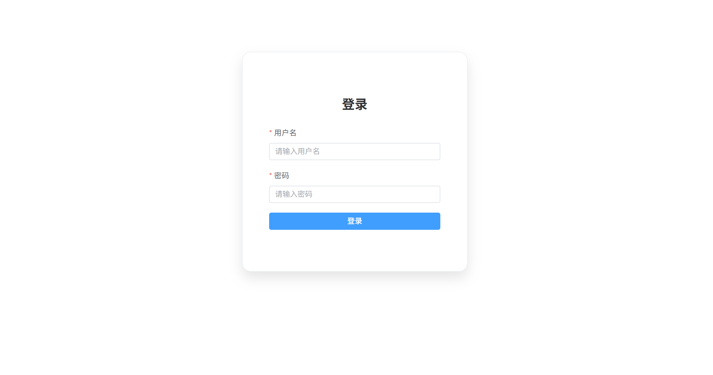
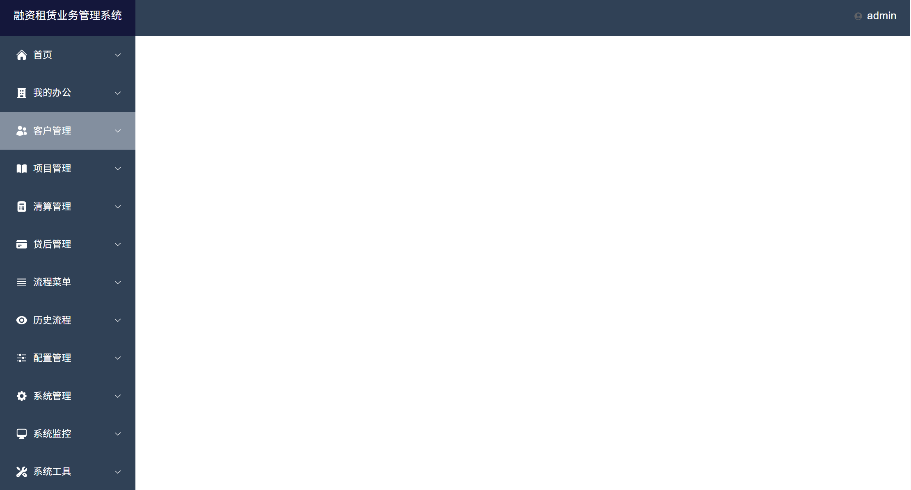

# 融资租赁业务管理系统

## 运行方式
### 前端
npm install  
npm run dev  
npm run build (打包后直接到后端/back-end/src/main/resources/static)

### 后端
执行SQL (创建库表) /back-end/src/main/resources/sql/index.sql  
配置类 BmsApplication 直接Run
## 功能模块
登录页面  
后台页面  
菜单页面需要定制化开发  

## 技术栈
### 前端
Vite Vue3 ElementUi-plus pinia TS
### 后端
JDK 17 Springboot3.0+ Mybatis-Plus Mysql8.0+ 

## 访问方式
打包前, npm run dev 出现的地址  
打包后, 直接localhost:8080
## 支持
需要定制化开发请联系作者  
Email hujuntulin@163.com

## 效果

